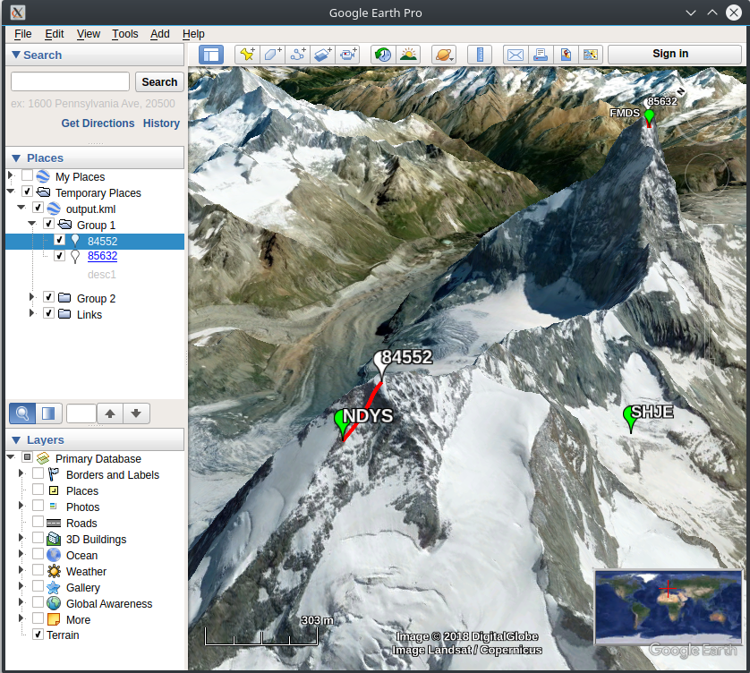

# Points to KML
This app converts a list of points to a KML file that can be visualized with [Google Earth](https://www.google.com/earth/).

## Install
```
npm install
```

## Usage
Prepare two [CSV](https://en.wikipedia.org/wiki/Comma-separated_values) files with the following format:

[points.csv](test/points.csv):
| id    | group | x / lon | y / lat  | desc  |
|-------|-------|---------|----------|-------|
| 85632 | 1     | 7.65833 | 45.97642 | desc1 |
| 84552 | 1     | 7.60494 | 45.96990 |       |
| FMDS  | 2     | 7.65764 | 45.97597 | desc2 |
| NDYS  | 2     | 7.60274 | 45.96999 |       |
| SHJE  | 2     | 7.62435 | 45.96626 | desc3 |

[links.csv](test/links.csv):
| id1   | id2  | desc  |
|-------|------|-------|
| 85632 | FMDS | link1 |
| 84552 | NDYS | link2 |

Run the app specifying the name of the CSV files:
```
$ node app.js points.csv links.csv
Read 5 points
Read 2 links
Generated output.kml
```

Open `output.kml` with Google Earth:
